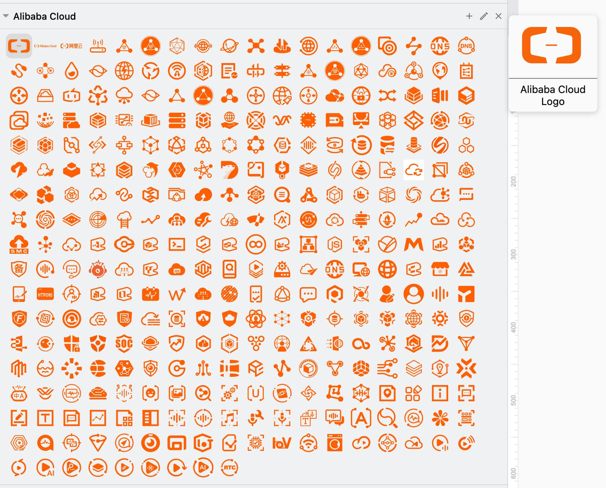

<p align="right">
    <strong>中文</strong> | <a href="./README.en.md">English</a>
</p>

## 阿里云官方矢量图标和 draw.io 自定义图标库

### 背景

在众多知名的绘图软件（如draw.io、Lucidchart、Gliffy、ProcessOn等）中都没有内置一套完整的、最新的阿里云官方矢量图标。  
因此，在画阿里云相关的网络拓扑图和架构图时，和AWS、Azure、GCP相比，很不方便。  
于是，我收集整理了一套完整的阿里云矢量图标，分别标注了中英文名称，并生成了相应的draw.io图标库，方便自己的同时也希望能够帮助到大家。  

### draw.io 自定义图标库截图



### draw.io 自定义库下载

<a href="2022-orange/drawio/cn/Alibaba%20Cloud.xml">中文版 Alibaba Cloud.xml</a> ｜ <a href="2022-orange/drawio/en/Alibaba%20Cloud.xml">英文版 Alibaba Cloud.xml</a>

### 阿里云矢量图来源

链接: [阿里云设计中心](https://www.iconfont.cn/user/detail?uid=6856114) | [阿里云产品类别](https://www.aliyun.com/product/list)

矢量图标颜色代码: `#ff6a00`

### draw.io 中图标的顺序

```
.
├── 00 Logo
├── 01 网络与CDN
├── 02 计算
├── 03 容器
├── 04 Serverless
├── 05 数据库
├── 06 存储
├── 07 中间件
├── 08 迁移与运维管理
├── 09 开发工具
├── 10 企业服务与云通信
├── 11 安全
├── 12 大数据计算
├── 13 人工智能与机器学习
├── 14 物联网
└── 15 媒体服务
```
